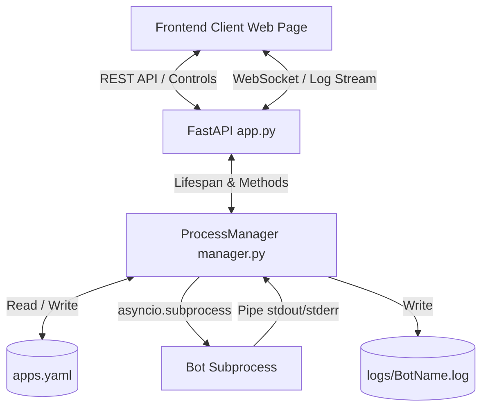

# Bot Supervisor Dashboard Documentation

This document serves as a comprehensive guide for both human administrators and AI coding assistants (LLMs) to understand, maintain, deploy, and extend the Bot Supervisor Dashboard.

---

# PART 1: Human User Guide

## Overview
The Bot Supervisor Dashboard is a lightweight, self-hosted web control panel and process supervisor. It is designed to manage Python scripts and `uv` projects (e.g., Telegram bots) running on a home server. It eliminates the need to write individual `systemd` services or manage fragile `tmux` startup sessions by providing a central interface to monitor status, review real-time logs, and start/stop/restart scripts.

## Core Features
1. **Unified Dashboard**: View CPU/RAM resource usage, active process IDs (PIDs), and uptimes for all configured scripts.
2. **Log Streaming**: Live stdout/stderr logging via WebSockets with text-based coloring for warnings and errors.
3. **Log Previews**: Small log console windows rendered directly under each bot card for rapid diagnostics, togglable globally.
4. **Boot Autostart**: Auto-runs bots flagged with `auto_start: true` when the host server reboots.
5. **Crash Recovery**: Detects process crashes, performs exponential backoff retries, and flags failed scripts with an `error` state.
6. **Config Portability**: Export and import your entire supervisor config as a single JSON file.

## Server Deployment (Linux)

### Prerequisites
- Python 3.10+
- `uv` (installed via package manager or standard curl script)

### Step 1: Clone and Prepare
```bash
git clone https://github.com/Trifase/bot-dashboard.git
cd bot-dashboard
```

### Step 2: Systemd User Service Setup
Running the dashboard as a systemd **user** service is recommended because it runs in user-space without root/sudo privileges.

1. Create the systemd user config directory:
   ```bash
   mkdir -p ~/.config/systemd/user/
   ```
2. Copy the service unit file:
   ```bash
   cp bot-dashboard.service ~/.config/systemd/user/
   ```
3. Edit `~/.config/systemd/user/bot-dashboard.service` to match your home folder username and `uv` path:
   - Run `which uv` to find the path (e.g. `/home/luca/.local/bin/uv`).
   - Modify `WorkingDirectory` and `ExecStart` inside the file.
4. Enable and start the service:
   ```bash
   systemctl --user daemon-reload
   systemctl --user enable bot-dashboard.service
   systemctl --user start bot-dashboard.service
   ```
5. **Enable Linger**: Ensure your user processes start at boot and continue running after you close SSH:
   ```bash
   loginctl enable-linger $USER
   ```

### Step 3: Accessing the Web UI
Open your browser and navigate to: `http://<server-ip>:8000`.

---

## Daily Operations

### Adding a New Python/`uv` Script
1. Click **Add Script** in the top right.
2. Fill in:
   - **Bot Name**: Unique identifier (e.g., `ImageFetcher`).
   - **Project Directory**: Absolute directory of your bot project (e.g., `/home/luca/tg-pics-fetcher`).
   - **Entrypoint Script**: Script file name (e.g., `main.py`).
3. Toggle options for auto-start and crash restarts as needed.

### Running Non-`uv` System Python Projects
If a script relies on system Python packages rather than a local virtual environment:
1. In the bot's configuration modal, expand **Environment Variables**.
2. Add the following JSON environment variable:
   ```json
   {
     "UV_SYSTEM_PYTHON": "1"
   }
   ```
This tells the process supervisor to launch the bot using the system Python interpreter instead of isolating it in a new environment.

### Backup and Restore Config
- **Exporting**: Click **Export Config** in the options bar. This downloads a `bot-dashboard-config.json` containing only the static configuration elements.
- **Importing**: Click **Import Config**, select your saved JSON file, and confirm. This overwrites your local `apps.yaml`, stops any currently running processes, and boots the new list.

---
---

# PART 2: LLM / Developer Technical Specification

This section outlines the codebase architecture, type structures, and internal APIs for developers or AI coding assistants extending this application.

## Directory Structure
```text
bot-dashboard/
│
├── app.py                # FastAPI HTTP Server, WebSockets, & lifespan hooks
├── manager.py            # ProcessManager engine (subprocess management & stats)
├── config.py             # YAML Config parser (apps.yaml read/write)
├── pyproject.toml        # Standalone uv dependency file (package = false)
├── bot-dashboard.service # systemd user service template
├── apps.yaml             # Configured bots database (Git ignored)
│
├── static/               # Frontend Client assets
│   ├── index.html        # App layout, console modals, forms
│   ├── style.css         # Glassmorphic style sheet and terminal theme
│   └── app.js            # Frontend state, WebSocket streaming, and API fetch calls
│
└── logs/                 # Folder containing bot stdout/stderr log files (Git ignored)
    └── [AppName].log
```

## System Architecture



## Internal Data Schemas

### YAML Database Schema (`apps.yaml`)
Stores the configuration array under the `apps` key:
```yaml
apps:
  - name: string                  # Unique script ID (unique key)
    path: string                  # Absolute directory path containing the script
    entrypoint: string            # File name of script relative to directory (default: main.py)
    auto_start: boolean           # Auto-starts when supervisor initializes (default: false)
    restart_on_failure: boolean   # Restarts script if it crashes (default: true)
    max_restarts: integer         # Maximum retries inside restart loop (default: 5)
    env: dict                     # Key-Value environment variables injected into process (default: {})
```

### Runtime Stat Schema (`ProcessManager.get_app_stats()`)
Returns combined runtime statistics of a bot process:
```json
{
  "name": "string",
  "status": "string",             // "running" | "stopped" | "restarting" | "stopping" | "error"
  "uptime": "integer",            // Seconds since process started
  "cpu": "float",                 // CPU percent accrued for process + child processes
  "memory": "float",              // Resident Set Size (RSS) memory in MB (process + children)
  "pid": "integer | null"         // System Process ID of parent uv process
}
```

---

## Process Lifecycle and Execution Mechanics

### Subprocess Spawning
Bots are launched using `asyncio.create_subprocess_exec` executing:
```python
uv_path run python entrypoint
```
The execution environment is modified prior to spawning:
1. `VIRTUAL_ENV` is deleted from the environment dictionary copy. This prevents the parent dashboard's virtualenv from overriding the bot's local environment.
2. `PYTHONUNBUFFERED` is forced to `"1"`. This disables output buffering, guaranteeing stdout/stderr messages stream in real-time.
3. User-defined environment variables specified in the bot's configuration are appended.

### System PATH Resolution (Self-Healing)
If the dashboard runs inside a minimal environment (like systemd) where `uv` is not present in standard path variables, `manager.py` checks common local directories:
- `~/.local/bin/uv`
- `~/.cargo/bin/uv`
- `~/.astral/bin/uv`
- `%APPDATA%/Local/Programs/uv/uv.exe` (Windows development)

### Resource Aggregation
Standard system monitors check parent PIDs. Since `uv run python` launches a parent `uv` wrapper process and a child `python` script, checking the parent PID misses the bot's memory usage. The resource metrics aggregator recursively navigates and sums CPU and memory percentages for all child processes under the wrapper PID using `psutil`.

---

## REST & WebSocket API Reference

### 1. List Apps
- **Endpoint**: `GET /api/apps`
- **Response**: Array of merged App Configs and Runtime Stats, including a `log_preview` field containing the last 4 log lines.

### 2. Add App
- **Endpoint**: `POST /api/apps/add`
- **Body**:
  ```json
  {
    "name": "WelcomeBot",
    "path": "/home/user/bots/welcome-bot",
    "entrypoint": "bot.py",
    "auto_start": true,
    "restart_on_failure": true,
    "max_restarts": 5,
    "env": { "TOKEN": "123" }
  }
  ```

### 3. Edit App
- **Endpoint**: `POST /api/apps/{name}/edit`
- **Body**: Partial updates allowed (`path`, `entrypoint`, `auto_start`, `restart_on_failure`, `max_restarts`, `env`).

### 4. Delete App
- **Endpoint**: `DELETE /api/apps/{name}`
- **Behavior**: Stops process if active and removes configuration entry.

### 5. Control Commands
- **Start App**: `POST /api/apps/{name}/start`
- **Stop App**: `POST /api/apps/{name}/stop` (Sends `SIGINT` on Linux; falls back to `SIGKILL` after 5 seconds)
- **Restart App**: `POST /api/apps/{name}/restart`

### 6. Read Log History (Static)
- **Endpoint**: `GET /api/apps/{name}/logs?lines=200`
- **Response**: `{"logs": "string"}`

### 7. Real-Time Log Stream
- **Endpoint**: `WS /api/apps/{name}/logs/ws`
- **Behavior**: Opens persistent WebSocket. Streams last 150 historical lines upon connection, then streams new stdout/stderr logs in real-time.

### 8. Config Bulk Import
- **Endpoint**: `POST /api/config/import`
- **Body**: Array of App configurations.
- **Behavior**: Gracefully stops all active processes, clears configuration database, registers new imports, saves to disk, and triggers auto-starts.
